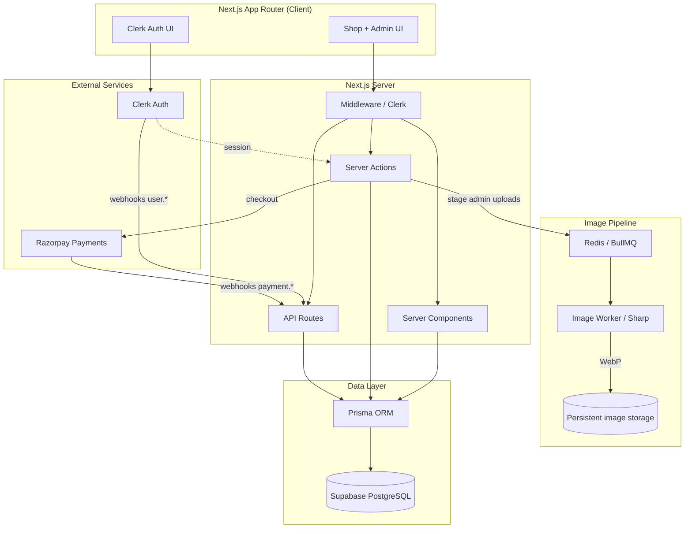
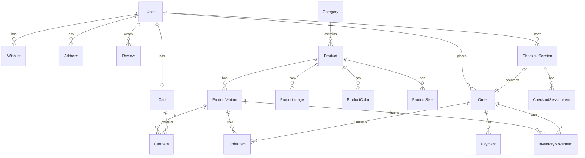

# Post Mart Architecture

## System diagram



## Request flow

```
Browser
  → Clerk (auth session)
  → Server Actions / API Routes
  → services/*
  → Prisma
  → Supabase PostgreSQL
```

Payments: **Razorpay webhook** is authoritative (not frontend success).  
Media: admin uploads use persistent local/VPS storage through Redis/BullMQ and Sharp. Storefront image reads resolve only validated local storage paths.

## Core tables (ER overview)



## Product URLs

**Slug-based:** `/product/aero-one`

## Production safeguards (verified — do not duplicate)

| System | Location |
|--------|----------|
| InventoryMovement audit | `InventoryMovement` + `inventory-service.js` |
| Atomic oversell protection | `decrementStockForSale` (`updateMany` + `count === 1`) |
| Webhook logging | `WebhookEvent` + `webhook-log-service.js` |
| Refund foundation | `Payment.refundedAt`, `Order.refundReason`, `refund-service.js` |
| Payment verification | Razorpay signature + amount match + idempotency |
| Order snapshots | `OrderItem` + shipping fields on `Order` |

## Admin products (Phase 5)

- Create / edit / soft-delete: `product-admin-service.js` + `admin-product-actions.js`
- Pages: `/admin/products/new`, `/admin/products/[id]/edit`
- Images: filesystem staging (`image-upload-service.js`) → BullMQ → Sharp worker → persistent WebP storage
- New products appear on storefront via `revalidatePath` (products, slug, categories, search)

## Rate limiting

In-memory sliding window per IP (`lib/rate-limit.js`) on checkout, cart, newsletter, admin mutations, geocode, webhooks.

## Commands

```bash
npm run db:push
npm run db:seed
npm run dev
```

## Env

See `.env.local.example` — database, Clerk (`CLERK_WEBHOOK_SECRET`), Razorpay, Redis/BullMQ, and `IMAGE_STORAGE_ROOT`.

## Manual testing checklist

### Payments
- [ ] Duplicate Razorpay webhook → `DUPLICATE_EVENT` log, no second order
- [ ] Tampered payment amount → `PAYMENT_AMOUNT_MISMATCH`
- [ ] Invalid webhook signature → `INVALID_SIGNATURE` (401)
- [ ] Successful capture → `FULFILLED`, stock reduced once

### Inventory
- [ ] Two users checkout last unit → one `FULFILLED`, one `OUT_OF_STOCK`
- [ ] `InventoryMovement` rows for each sale
- [ ] Stock only changes after webhook (not cart/checkout)

### Cart
- [ ] Guest cart (localStorage)
- [ ] Signed-in cart (database)
- [ ] Sign-in merge behavior

### Addresses
- [ ] Create / edit / delete / default on profile
- [ ] Saved address at checkout
- [ ] Manual entry at checkout
- [ ] “Use my location” fills fields

### Orders
- [ ] Order after webhook
- [ ] Invoice download
- [ ] Order history + statuses

### Admin
- [ ] Create product → visible on `/products` and `/product/[slug]`
- [ ] Edit / soft-delete product
- [ ] Local image upload → BullMQ worker → stored WebP
- [ ] Orders dashboard
- [ ] Inventory movement history (Prisma Studio)

### Newsletter
- [ ] Subscribe + rate limit on spam
