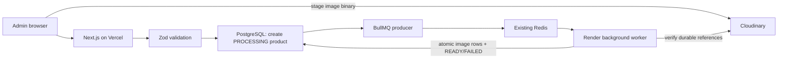

# BullMQ product image processing

## Why BullMQ was added

Product creation previously had two related problems: the admin waited for Cloudinary uploads before saving, while the first BullMQ attempt then queued the *entire* database create. That meant there was no product record or processing status if the worker was delayed, and queue payloads were not validated or idempotent.

BullMQ now moves durable image verification and database image finalization out of the Vercel request. The required product, category, size, compatibility-variant, stock, and processing-state data remains a fast synchronous Prisma write. Zod validates both the Server Action input and the worker payload.

The existing upload UI stages image binaries in Cloudinary before product submission. BullMQ contains only Cloudinary references—never `File`, buffer, or base64 data. The Cloudinary widget uploads directly from the browser. The server-upload fallback still uses a Vercel Server Action during image selection; moving that raw transfer to the worker would require a separate durable temporary object store or direct signed browser uploads for every path.

## Architecture



Vercel continues to run Next.js, SSR, Server Components, Server Actions, and API routes. It only produces jobs. Render runs `npm run worker` as a long-lived Background Worker and does not run Next.js or an HTTP server. Redis stores BullMQ jobs and state. PostgreSQL remains the source of truth for product readiness. Cloudinary remains the durable image store.

## Code layout

- `schemas/product.schema.js`: product-create and Cloudinary-reference schemas.
- `schemas/queue.schema.js`: job and worker-environment schemas.
- `queues/image.queue.js`: lazy BullMQ queue construction and defaults.
- `queues/product.queue.js`: enqueue, deterministic job ID, state inspection, and retry.
- `queues/index.js`: producer-facing exports.
- `workers/image.worker.js`: validates jobs, verifies Cloudinary resources, and finalizes image rows.
- `workers/product.worker.js`: worker concurrency, rate limiter, events, failure status, and structured logs.
- `workers/index.js`: standalone process entry point and graceful shutdown.
- `lib/queues/connection.js`: centralized Redis connection options for producers and workers.

BullMQ uses its ioredis integration and the existing `REDIS_URL`; no additional Redis library or Redis server is introduced. Producers use a short connection timeout and limited request retries so a Vercel invocation fails instead of hanging. Workers use BullMQ’s required `maxRetriesPerRequest: null` behavior.

## Product creation and image lifecycle

1. The admin stages up to eight images in Cloudinary.
2. `createProductAction` validates the product with Zod.
3. Prisma creates the product with `PROCESSING`, synchronous relations, and `pendingImageUrls`. This nested create is atomic.
4. The producer validates the job payload again and adds `finalize-product-images` using `product-images-{productId}` as `jobId`.
5. The action stores the BullMQ job ID and returns. The UI redirects immediately with a “processing images” message.
6. The worker validates `job.data`, confirms the product still exists, compares the job references with the PostgreSQL staging references, and verifies each Cloudinary public ID.
7. One Prisma transaction creates ordered `ProductImage` metadata and sets the product to `READY`. `pendingImageUrls` is cleared only on success.
8. A final failure sets `FAILED` and preserves staging references. The admin list exposes the reason and a Retry action.

Storefront queries include only `READY` products. Existing rows migrate as `READY`, so the migration does not hide the current catalog.

## Job lifecycle, idempotency, and retries

The deterministic job ID deduplicates accidental duplicate enqueue calls for one product. The worker also exits early for an already-`READY` product, compares queued references with the durable staging record, and rechecks product state inside the atomic final transaction. BullMQ runs one instance of a deterministic job at a time, while the `READY` guard makes later delivery a no-op.

Jobs have three attempts with exponential backoff starting at three seconds. Network, Redis, Cloudinary 5xx/rate-limit, and transient database failures are retried. Invalid Zod payloads, missing/deleted products, staging-reference mismatches, and Cloudinary 404 responses use BullMQ `UnrecoverableError` and do not consume pointless retries.

Completed jobs are retained for up to 24 hours (maximum 1,000). Failed jobs are retained for up to seven days (maximum 5,000). Worker logs are structured JSON and include queue, event, job ID, product ID, attempt count, and error message. Credentials and payload image bytes are not logged.

If enqueue fails after the database create, the product is marked `FAILED`; its small Cloudinary references remain in PostgreSQL for recovery. If the worker is stopped, Redis retains waiting/delayed jobs and the product remains `PROCESSING`. A restart resumes consumption. If a product is deleted before processing, the job fails permanently and no image rows are attached. Image metadata is committed atomically, so a database failure cannot leave a partially attached image set.

Cloudinary staging assets are deliberately not destroyed automatically on a processing failure because the admin retry path needs them. The existing discard action remains responsible for explicit cleanup of abandoned uploads. A future scheduled cleanup queue can delete staging assets that are no longer referenced by a live or failed product.

## Concurrency and backpressure

Defaults:

```text
BULLMQ_WORKER_CONCURRENCY=3
BULLMQ_WORKER_RATE_MAX=20
BULLMQ_WORKER_RATE_DURATION_MS=10000
BULLMQ_REDIS_CONNECT_TIMEOUT_MS=3000
```

Concurrency is capped at 20 by Zod. The default permits three product jobs per Render process; each job verifies at most eight images sequentially. The limiter caps starts to 20 jobs per 10 seconds per worker, so Redis can absorb bursts without turning them into unlimited Cloudinary or PostgreSQL concurrency.

There is one Prisma singleton per worker process, shared by all concurrent jobs. Work slots are `Render instances × BULLMQ_WORKER_CONCURRENCY`. Database connections are bounded separately by the Prisma/PostgreSQL pool configured in `DATABASE_URL`; a practical capacity review should use `Render instances × connection_limit`, while remembering that higher job concurrency creates more simultaneous demand within each pool. Do not increase `connection_limit` or worker concurrency without checking PostgreSQL capacity and Cloudinary rate limits.

## Environment variables

Copy `.env.local.example` for local development. Never expose Redis, database, Cloudinary API, Clerk secret, or payment credentials through `NEXT_PUBLIC_*`.

Vercel requires the existing application variables plus:

```text
DATABASE_URL
DIRECT_URL                 # build/migration workflows as currently used
REDIS_URL                  # BullMQ producer
BULLMQ_REDIS_CONNECT_TIMEOUT_MS=3000
```

Render Background Worker requires:

```text
DATABASE_URL
REDIS_URL
CLOUDINARY_CLOUD_NAME
CLOUDINARY_API_KEY
CLOUDINARY_API_SECRET
BULLMQ_WORKER_CONCURRENCY=3
BULLMQ_WORKER_RATE_MAX=20
BULLMQ_WORKER_RATE_DURATION_MS=10000
BULLMQ_REDIS_CONNECT_TIMEOUT_MS=3000
```

`DIRECT_URL` may also be supplied to Render for Prisma build or migration tooling, but the worker must use the pooled runtime `DATABASE_URL`. Vercel and Render must point at the same PostgreSQL database, Redis instance, and Cloudinary account. Do not hard-code any of these values.

## Local development and queue testing

Install and generate the client:

```bash
npm install
npm run db:generate
```

Apply development migrations using the project’s existing Prisma workflow:

```bash
npm run db:migrate
```

Start Next.js and the worker in separate terminals. The worker script loads `.env` and `.env.local` when present; platform-injected environment variables retain priority:

```bash
npm run dev
```

```bash
npm run worker
```

With PostgreSQL, Redis, and Cloudinary credentials configured, create a product from `/new-admin/products/new`. Confirm that the action returns to the product list with `PROCESSING`, Redis contains `product-image-processing`, the worker logs `active` then `completed`, and the row becomes `READY`. Stop the worker, create another product, and restart it to verify queued-job recovery. To test retries safely, temporarily use an unavailable Cloudinary endpoint/account in an isolated environment; restore credentials and use Retry. Send `Ctrl+C` to verify `SIGINT` graceful shutdown. Render uses `SIGTERM` during restarts.

No test job should contain production secrets or throwaway base64 data. Use an isolated database/Cloudinary folder for integration testing.

## Deployment

Run the Prisma migration in the normal controlled release process before code that writes the new fields:

```bash
npm run db:deploy
npm run build
```

Deploy Next.js to Vercel using the project’s existing Vercel pipeline. Do not move SSR to Render.

Create a Render **Background Worker** from the same repository and branch. Conceptual settings:

```text
Build command: npm install
Start command: npm run worker
```

Add the Render environment variables listed above. Do not configure a web service or health-check HTTP port for this worker. Scale to multiple worker instances only after confirming PostgreSQL pool, Redis connection, Cloudinary API, memory, and CPU capacity.

## Adding future queues

Add a focused Zod payload schema, a queue producer that validates before `add`, and a worker processor that validates `job.data` again. Give every irreversible operation a stable business idempotency key and a database guard. Register the worker in `workers/index.js`, add bounded concurrency/rate limits, structured failure logs, and shutdown coverage. Keep client components and Server Components free of worker imports; only Server Actions/API routes may import producer utilities.

Good background candidates include invoice generation, external catalog synchronization, email delivery, and expensive media transformation. Keep authentication, authorization, inventory reservation, payment verification, order creation, required product metadata, and any transaction needed for request correctness synchronous.

Never put passwords, API keys, payment secrets, Redis credentials, unnecessary personal data, browser `File` objects, buffers, or large base64 strings into BullMQ. Store durable data first and enqueue small IDs/references.

## Troubleshooting

- **Product stays PROCESSING:** ensure the Render worker is running, `REDIS_URL` matches Vercel, and inspect structured worker logs/job state. A stopped worker does not lose the job.
- **Product is FAILED immediately:** inspect `processingError`; permanent causes include invalid/missing Cloudinary resources or a deleted product. Fix the staging source and retry.
- **Vercel reports queue unavailable:** check Redis TLS/credentials/network. The product remains `FAILED` and recoverable rather than appearing ready.
- **Worker exits on startup:** Zod rejected a missing/invalid Redis, database, Cloudinary, concurrency, limiter, or timeout variable.
- **Too many database connections:** reduce Render instances and concurrency, confirm one worker process per instance, and review `connection_limit` before changing pool size.
- **Cloudinary rate limits:** lower concurrency or `BULLMQ_WORKER_RATE_MAX`, then retry failed jobs after the provider window resets.
- **Duplicate execution:** the job ID, READY guard, staging comparison, transaction recheck, and database unique key should make duplicates no-ops. Investigate manual database edits if those invariants disagree.
- **Graceful shutdown appears slow:** `worker.close()` stops fetching and waits for active work. Reduce per-job image count/concurrency or increase the platform shutdown grace period if needed.

## Scaling and future platforms

Scale vertically first, then add Render worker instances conservatively. Redis coordinates job ownership across instances. Measure queue depth, completion latency, failure rate, Cloudinary response time, PostgreSQL pool utilization, and worker memory before changing concurrency.

For Docker or Kubernetes, keep the same separate process model: one Next.js deployment and one worker deployment using `npm run worker`. Use `SIGTERM`, a sufficient termination grace period, a managed Redis service, pooled PostgreSQL URLs, and Kubernetes Secrets. Horizontal Pod Autoscaling should use queue depth/latency rather than HTTP traffic. The queue and schema modules are platform-neutral; no Render-only secret or API is embedded in code.
